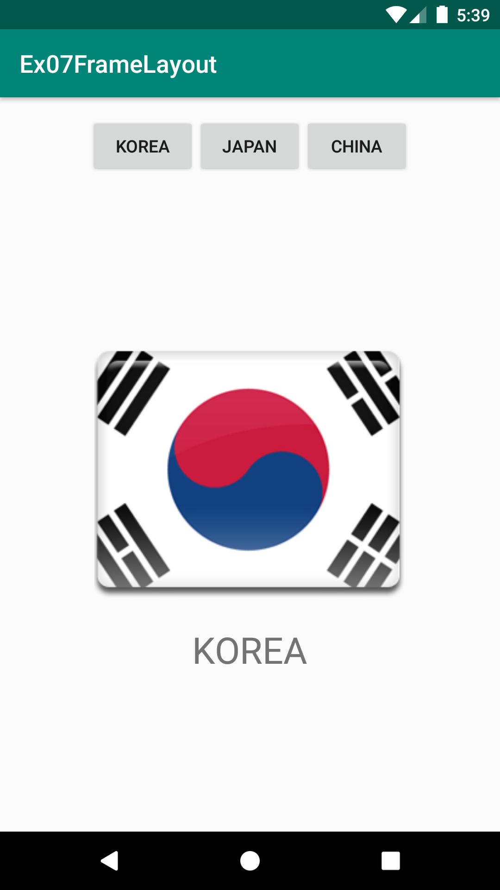
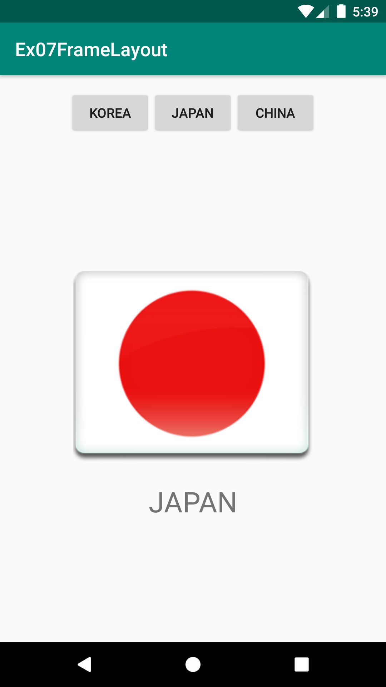
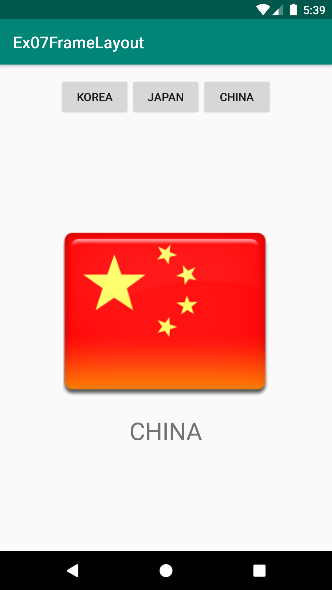
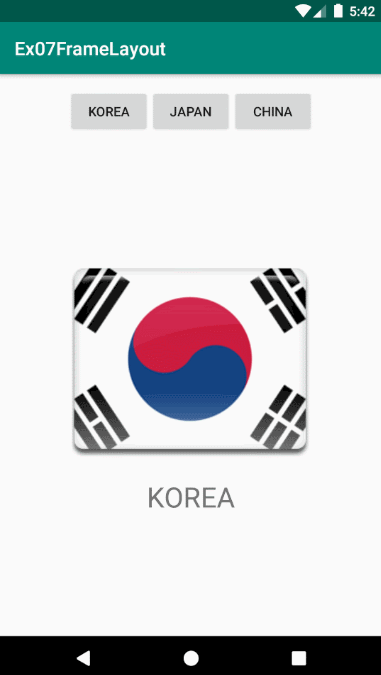

# Ex07FrameLayout
안드로이드 네이티브 앱 개발 수업 예제#7

# 주요코드
FrameLayout 배치 특징 알아보기

- res폴더>>layout폴더안에 있는 activity_main.xml문서를 수정하여 화면제작
- FrameLayout안에 배치된 자식뷰들은 기본적으로 좌상단에 겹쳐서 배치됨
- 버튼을 클릭할 때 마다 화면이 전환되는 Tab과 비슷한 동작으로 FrameLayout으로 구현해보기

# 실행모습

  
  
  

# 실행모습 GIF

  

